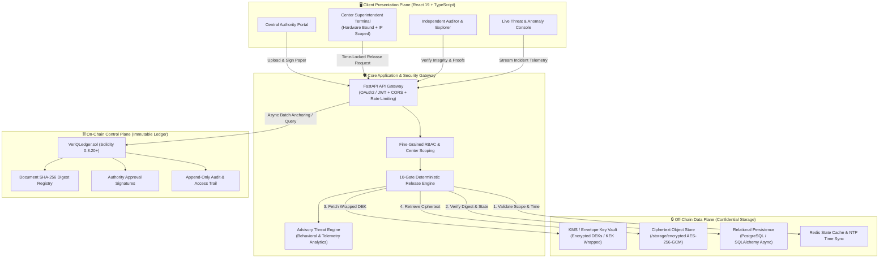
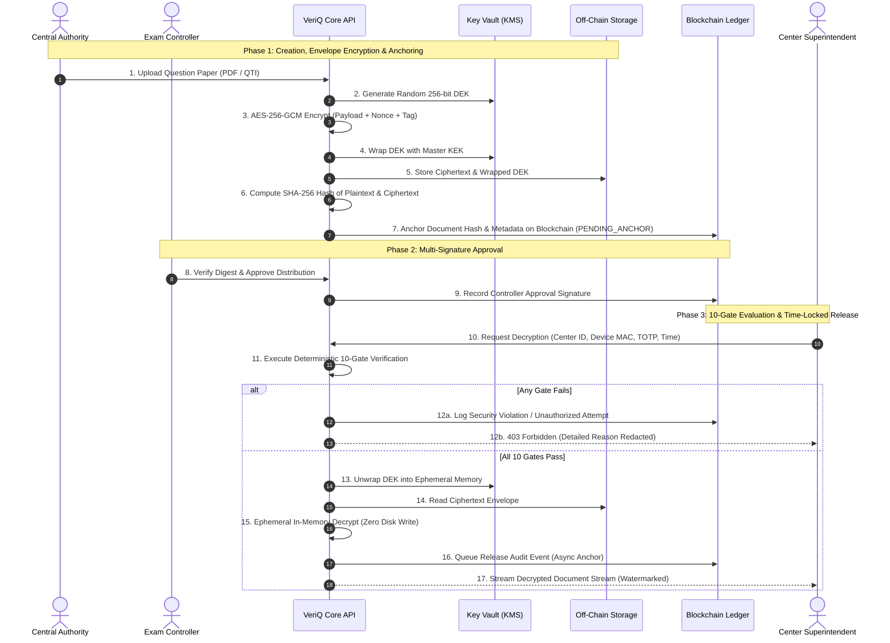
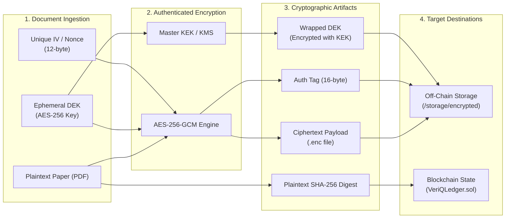

<div align="center">


# VeriQ — Secure Examination Paper Distribution Using Blockchain

**Secure Every Question Paper. Verify Every Action.**

*National Examination Lifecycle, Envelope Encryption, Time-Locked Decryption & Tamper-Evident Blockchain Proof Architecture*

---

[](https://github.com)
[](docs/07_SYSTEM_ARCHITECTURE.md)
[](docs/11_SECURITY_ARCHITECTURE.md)
[](https://fastapi.tiangolo.com)
[](https://react.dev)
[](https://soliditylang.org)
[](LICENSE)

[Architecture](#-system-architecture) • [10-Gate Engine](#-10-gate-deterministic-release-engine) • [Live Demos](#-demo-personas--role-based-access) • [Threat Simulations](#-attack-simulation--security-testing) • [Docs Suite](#-enterprise-documentation-suite) • [Quickstart](#-quickstart--local-setup)

---

</div>

## 📑 Table of Contents

- [Executive Summary](#-executive-summary)
- [Key Security Invariants & Value Pillars](#️-key-security-invariants--value-pillars)
- [System Architecture](#️-system-architecture)
  - [High-Level Dual-Plane Topology](#1-high-level-dual-plane-topology)
  - [End-to-End Examination Lifecycle Flow](#2-end-to-end-examination-lifecycle-flow)
  - [Cryptographic Envelope Encryption Model](#3-cryptographic-envelope-encryption-model)
- [10-Gate Deterministic Release Engine](#-10-gate-deterministic-release-engine)
- [Demo Personas & Role-Based Access (RBAC)](#-demo-personas--role-based-access-rbac)
- [Attack Simulation & Security Testing](#️-attack-simulation--security-testing)
- [Enterprise Documentation Suite](#-enterprise-documentation-suite)
- [Repository Structure](#-repository-structure)
- [Quickstart & Local Setup](#-quickstart--local-setup)
  - [Prerequisites](#prerequisites)
  - [Installation & Seeding](#1-installation--seeding)
  - [Running the Application](#2-running-the-application)
  - [Running Automated Tests](#3-running-automated-tests)
- [API & Swagger Documentation](#-api--swagger-documentation)
- [Deployment Readiness](#-deployment-readiness)
- [Delivery Roadmap](#️-delivery-roadmap)
- [License](#-license)

---

## 📖 Executive Summary

High-stakes national and state-level examinations (e.g., recruitment, university entrances, professional certifications) face continuous security threats: physical transit leaks, corrupt custodial intermediaries, premature unauthorized digital decryption, unvetted release devices, and audit tampering.

**VeriQ** (*Problem Statement WB-03*) is an enterprise-grade, cryptographically verifiable examination lifecycle and distribution platform. It decouples high-performance off-chain content delivery from immutable on-chain integrity proofs, enforcing strict multi-factor time-locks and cryptographic non-repudiation across the entire lifecycle of an examination paper.

```
                  ┌─────────────────────────────────────────────────────────┐
                  │                 TRADITIONAL EXAM SYSTEMS                │
                  │  ❌ Plaintext database storage                           │
                  │  ❌ Centralized mutable logs (easy insider tampering)   │
                  │  ❌ Loose manual time/approval coordination             │
                  │  ❌ Zero device or center biometric binding             │
                  └─────────────────────────────────────────────────────────┘
                                               │
                                       TRANSFORMED INTO
                                               ▼
                  ┌─────────────────────────────────────────────────────────┐
                  │                   VERIQ SECURE FABRIC                   │
                  │  ✅ Off-Chain AES-256-GCM Envelope Encryption           │
                  │  ✅ On-Chain Merkle Hash Registry (Ethereum / EVM)      │
                  │  ✅ Hardware Fingerprinted + IP-Whitelisted Release     │
                  │  ✅ 10-Gate Deterministic Verification Engine           │
                  │  ✅ Advisory AI Threat Telemetry & Incident Triage      │
                  └─────────────────────────────────────────────────────────┘
```

---

## 🛡️ Key Security Invariants & Value Pillars

1. **Zero Plaintext Persistence Guarantee**: Unencrypted examination question papers and raw Data Encryption Keys (DEKs) are never written to disk, PostgreSQL databases, S3 buckets, log streams, or blockchain calldata.
2. **Dual-Plane Architecture**: Decouples the **Off-Chain Secure Data Plane** (FastAPI, Redis, PostgreSQL/Object Storage) from the **On-Chain Control Plane** (EVM Smart Contracts, Merkle Anchors, Immutable Access Ledger).
3. **Deterministic 10-Gate Release Engine**: Decryption keys can only be retrieved if all 10 independent verification gates pass in strict order. Any single failure triggers immediate fail-closed denial and emits security telemetry.
4. **Decoupled Blockchain Anchoring**: Exam release execution is asynchronous and decoupled from public/consortium blockchain block confirmation latency, ensuring deterministic center releases under any network conditions.
5. **Advisory-Only Threat Telemetry**: Built-in AI anomaly detection evaluates access behavioral telemetry to assist SecOps teams, while maintaining strict zero-authority boundaries over core authorization or cryptographic key release.

---

## 🏛️ System Architecture

### 1. High-Level Dual-Plane Topology



---

### 2. End-to-End Examination Lifecycle Flow



---

### 3. Cryptographic Envelope Encryption Model



---

## 🔒 10-Gate Deterministic Release Engine

To prevent premature access, insider leaks, or unauthorized downloads, the **10-Gate Release Engine** evaluates release requests strictly in sequential order. A failure at any gate immediately halts execution and enters a secure fail-closed state:

| Gate | Gate Name | Enforcement Check | Failure Outcome |
|:---:|:---|:---|:---|
| **G1** | **Authentication Gate** | Validates signed JWT token, signature validity, and active session state. | `401 Unauthorized` |
| **G2** | **Role Authorization Gate** | Asserts caller possesses `CENTER_SUPERINTENDENT` or `EXAM_CONTROLLER` role. | `403 Forbidden` |
| **G3** | **Center Scope Gate** | Validates caller is explicitly assigned to the specific exam center ID requested. | `403 Forbidden` |
| **G4** | **Device Hardware Gate** | Compares client hardware MAC/UUID & IP against whitelisted center perimeter list. | `403 Forbidden (Device Mismatch)` |
| **G5** | **Server UTC Time-Lock** | Authoritative NTP-synchronized server clock is within `[T - Δt, T + exam_duration]`. | `425 Too Early / 410 Expired` |
| **G6** | **Version Lock Gate** | Asserts requested paper version matches latest approved & published version. | `409 Conflict` |
| **G7** | **Emergency Revocation Gate** | Confirms examination status is not `REVOKED`, `SUSPENDED`, or `FLAGGED`. | `423 Locked` |
| **G8** | **Ciphertext Hash Integrity** | Compares on-disk ciphertext SHA-256 with stored cryptographic manifest. | `500 Integrity Corrupted` |
| **G9** | **KMS Key Unwrap Gate** | Ephemeral unwrap of DEK using hardware-backed Master Key Encryption Key (KEK). | `500 Key Unwrap Error` |
| **G10** | **Audit & Blockchain Queue** | Dispatches access audit transaction to persistent DB & asynchronous blockchain queue. | `500 Audit Queue Failure` |

---

## 👥 Demo Personas & Role-Based Access (RBAC)

The pre-seeded database includes distinct operational personas to demonstrate end-to-end segregation of duties across national, regional, and examination center levels:

| Persona / Role | Demo Email | Demo Password | Centre Scope | Core Responsibilities |
|:---|:---|:---|:---|:---|
| **Super Admin** (`SUPER_ADMIN`) | `admin@veriq.local` | `password123` | *Global / National* | Full governance, examination scheduling, paper approvals, security monitoring, and cryptographic audit oversight. |
| **Paper Setter** (`PAPER_SETTER`) | `setter@veriq.local` | `password123` | *Authoring Unit* | Examination question paper authoring, AES-256-GCM envelope encryption, SHA-256 hashing, and custody submission. |
| **Centre Admin** (`CENTRE_ADMIN`) | `centre@veriq.local` | `password123` | `C101` (Mumbai AIT) | Assigned examination oversight, terminal device authorizations, local release scheduling, and incident triage. |
| **Invigilator** (`INVIGILATOR`) | `invigilator@veriq.local` | `password123` | `C101` (Mumbai AIT) | Proctoring hall operations, terminal hardware validation, time-locked paper verification, and integrity checks. |

> [!TIP]
> **Additional Regional Personas Available:**
> - Pune Centre: `pune.admin@veriq.local` & `pune.invig@veriq.local` (Centre `C102`)
> - Bengaluru Centre: `blr.admin@veriq.local` (Centre `C103`)
> - Delhi Centre: `delhi.admin@veriq.local` & `delhi.invig@veriq.local` (Centre `C104`)
> - Hyderabad Centre: `hyd.admin@veriq.local` & `hyd.invig@veriq.local` (Centre `C105`)
> *(All pre-seeded test accounts use password: `password123`)*


---

## 🛡️ Attack Simulation & Security Testing

VeriQ includes built-in interactive attack simulations to validate security controls in real time:

```
[ LIVE THREAT SIMULATION CONSOLE ]
  ├── 🚨 Scenario 1: Premature Access Attempt (Evaluates Gate 5 Time-Lock Engine)
  ├── 🚨 Scenario 2: Bit-Level Document Tampering (Evaluates Gate 8 SHA-256 Integrity)
  ├── 🚨 Scenario 3: Rogue Hardware Device / IP Spoof (Evaluates Gate 4 Hardware Binding)
  ├── 🚨 Scenario 4: Cross-Center Scope Escalation (Evaluates Gate 3 Center Scope)
  └── 🚨 Scenario 5: Emergency Revocation Lockdown (Evaluates Gate 7 Emergency Circuit Breaker)
```

Each simulation triggers instantaneous UI alerts, logs defensive telemetry to the SecOps dashboard, and emits an immutable audit event.

---

## 📚 Enterprise Documentation Suite

The complete engineering and architecture specification for VeriQ is frozen under the [`docs/`](docs/) directory:

| ID | Document | Purpose & Scope | Status |
|:---:|:---|:---|:---:|
| **01** | [Repository Baseline Audit](docs/01_REPOSITORY_AUDIT.md) | Comprehensive audit of codebase, test inventory, and current gaps. | `v1.0.0 Frozen` |
| **02** | [Product Blueprint](docs/02_PRODUCT_BLUEPRINT.md) | Vision, problem framing, multi-persona architecture, and system pillars. | `v1.0.0 Frozen` |
| **03** | [Problem Statement](docs/03_PROBLEM_STATEMENT.md) | Formal problem analysis for WB-03 national examination distribution. | `v1.0.0 Frozen` |
| **04** | [Market & Competitive Research](docs/04_MARKET_RESEARCH.md) | Regulatory landscape (NTA, CBSE, UPSC), competitor analysis & compliance. | `v1.0.0 Frozen` |
| **05** | [Product Requirements (PRD)](docs/05_PRODUCT_REQUIREMENTS.md) | Functional requirements, user stories, acceptance criteria, and edge cases. | `v1.0.0 Frozen` |
| **06** | [Technical Requirements (TRD)](docs/06_TECHNICAL_REQUIREMENTS.md) | Non-functional requirements, cryptographic specs, latency SLAs, and scales. | `v1.0.0 Frozen` |
| **07** | [System Architecture](docs/07_SYSTEM_ARCHITECTURE.md) | Deep dual-plane design, module specifications, and component boundaries. | `v1.0.1 Frozen` |
| **08** | [AI Architecture](docs/08_AI_ARCHITECTURE.md) | Advisory threat intelligence, telemetry modeling, and human-in-the-loop limits. | `v1.0.2 Frozen` |
| **09** | [Database Design](docs/09_DATABASE_DESIGN.md) | Relational schema, indexes, state machine constraints, and ER diagrams. | `v1.0.1 Frozen` |
| **10** | [API Specification](docs/10_API_SPECIFICATION.md) | OpenAPI REST contracts, request/response models, and error structures. | `v1.0.0 Frozen` |
| **11** | [Security Architecture](docs/11_SECURITY_ARCHITECTURE.md) | Threat modeling (STRIDE), KMS key hierarchy, and 10-Gate security engine. | `v1.0.0 Frozen` |
| **12** | [UI/UX Design](docs/12_UI_UX_DESIGN.md) | Design system, persona workflows, responsive wireframes, and design tokens. | `v1.0.0 Frozen` |
| **13** | [Deployment Architecture](docs/13_DEPLOYMENT.md) | Container orchestration, Docker Compose, environment configs, and CI/CD. | `v1.0.0 Frozen` |
| **14** | [Testing Strategy](docs/14_TESTING_STRATEGY.md) | Verification matrix, unit/integration test suites, and cryptographic tests. | `v1.0.0 Frozen` |
| **15** | [Implementation Roadmap](docs/15_ROADMAP.md) | Dependency-aware execution roadmap, delivery phases, and milestones. | `v1.0.0 Frozen` |

---

## 📂 Repository Structure

```text
Paradox-Hack-2-Ignite/
├── backend/                       # Python FastAPI Core Application
│   ├── app/
│   │   ├── api/v1/                # Versioned REST API endpoints (auth, papers, audit, etc.)
│   │   ├── core/                  # Security, JWT, hashing, config settings
│   │   ├── db/                    # SQLAlchemy async engine, session, and models
│   │   ├── models/                # Database ORM entities (User, Paper, Center, Block)
│   │   ├── schemas/               # Pydantic v2 validation & serialization schemas
│   │   └── services/              # 10-Gate Engine, AES-GCM Crypto, Blockchain Anchor
│   ├── scripts/                   # Database seeding and migration utilities
│   ├── storage/                   # Encrypted off-chain paper repository (backend/storage/encrypted_papers)
│   └── tests/                     # Automated pytest test suite
│
├── frontend/                      # React 19 + TypeScript + Vite SPA
│   ├── src/
│   │   ├── components/            # UI Kit, Layout (Modular Sidebar, Topbar), Modals, HashViewer
│   │   ├── config/                # Centralized role and navigation configurations
│   │   ├── types/                 # Strongly typed domain models (auth, papers, exams, etc.)
│   │   ├── pages/                 # Role Dashboards, Papers, Release, Verify, SecOps, Blockchain
│   │   ├── services/              # Axios API client with token interceptors & domain services
│   │   └── store/                 # State management & authentication context
│   └── index.html
│
├── blockchain/                    # Web3 & Smart Contracts Layer
│   └── contracts/
│       └── VeriQLedger.sol        # Solidity smart contract for hash registry & audit proofs
│
├── shared/                        # Shared TypeScript types & cross-workspace constants
├── docs/                          # Complete 15-document frozen enterprise architecture suite
├── docker-compose.yml             # Local containerized infrastructure orchestration
├── package.json                   # Monorepo scripts (concurrently dev runner)
└── pnpm-workspace.yaml            # PNPM workspace configuration
```

---

## ⚡ Quickstart & Local Setup

### Prerequisites
- **Node.js**: `v20.x` or `v22.x`
- **pnpm**: `v9.x` or `v10.x`
- **Python**: `3.11+` (Python 3.12 / 3.13 supported)
- **Git**

---

### 1. Installation & Seeding

```bash
# Clone the repository
git clone https://github.com/shlok926/Paradox-Hack-2-Ignite.git
cd Paradox-Hack-2-Ignite

# Install root & frontend dependencies
pnpm install

# Setup Python Virtual Environment for Backend
cd backend
python -m venv venv

# Activate Virtual Environment (Windows PowerShell)
.\venv\Scripts\Activate.ps1
# OR Linux / macOS:
# source venv/bin/activate

# Install backend dependencies
pip install -r requirements.txt

# Seed pre-configured examination personas, centers, and papers
python scripts/seed_data.py
cd ..
```

---

### 2. Running the Application

You can start both backend and frontend concurrently with a single command from the root directory:

```bash
# Start both Backend (FastAPI :8000) and Frontend (Vite :3000)
pnpm run dev
```

Or run them individually in separate terminals:

```bash
# Terminal 1: Backend API Server
cd backend
uvicorn app.main:app --host 0.0.0.0 --port 8000 --reload

# Terminal 2: Frontend Client
cd frontend
pnpm run dev
```

- 🌐 **Web Application Portal**: [http://localhost:3000](http://localhost:3000)
- 📚 **Interactive Swagger API Docs**: [http://localhost:8000/docs](http://localhost:8000/docs)
- 🩺 **API Health Check**: [http://localhost:8000/api/v1/healthz](http://localhost:8000/api/v1/healthz)

---

### 3. Running Automated Tests
 
```bash
# Run Backend Pytest Suite (100% Passing Security & Crypto Tests)
pnpm run test:backend
# Or directly:
# cd backend && python -m pytest tests/ -v

# Run Frontend TypeScript & Build Validation
pnpm run test:frontend
# Or build full production bundle:
# pnpm run build:frontend
```

---

## 📡 API & Swagger Documentation

VeriQ provides interactive API documentation generated directly from Pydantic schemas:

| Endpoint Group | Route Prefix | Description |
|:---|:---|:---|
| **Authentication** | `/api/v1/auth` | JWT token issuance, session refresh, and credential validation. |
| **Examinations** | `/api/v1/exams` | Examination creation, scheduling, center binding, and state query. |
| **Question Papers** | `/api/v1/papers` | Paper upload, AES-256-GCM encryption, approval multi-sig, and metadata. |
| **10-Gate Release** | `/api/v1/access` | Time-locked evaluation, key unwrapping, and stream decryption. |
| **Centres & Devices** | `/api/v1/centres`, `/api/v1/devices` | Authorized centre registrations, device fingerprints, and status control. |
| **Blockchain** | `/api/v1/blockchain` | On-chain ledger blocks, Merkle proof verification, and transaction feed. |
| **Security & Incidents** | `/api/v1/security`, `/api/v1/incidents` | Threat telemetry, breach simulation triggers, and incident triage. |
| **Audit & Governance** | `/api/v1/audit` | Immutable audit trail querying and cryptographic verification. |

Access full interactive Swagger UI at [http://localhost:8000/docs](http://localhost:8000/docs) or ReDoc at [http://localhost:8000/redoc](http://localhost:8000/redoc).

---

## 🚀 Deployment Readiness

Deployment follows a validated workflow: validate, stage, smoke test, promote, and monitor.

- **Deployment Runbook**: [docs/deployment.md](docs/deployment.md) for supported operational commands
- **Production Checklist**: [docs/production-checklist.md](docs/production-checklist.md) for pre-release quality gates
- **Environment Specs**: [docs/environment.md](docs/environment.md) for strict production environment contracts
- **Deployment Topology**: [docs/deployment-architecture.md](docs/deployment-architecture.md) for multi-tier runtime architecture
- **Disaster Recovery**: [docs/disaster-recovery.md](docs/disaster-recovery.md) for failover & recovery procedures

---

## 🗺️ Delivery Roadmap

The VeriQ engineering execution strategy is structured into 5 phased milestones (see [15_ROADMAP.md](docs/15_ROADMAP.md) for detailed delivery tracking):

- **Phase 0: Baseline Stabilization & DevSecOps Foundation** *(Dockerfiles, Secrets, CI Pipeline)*
- **Phase 1: Deterministic 10-Gate Release Engine & Cryptographic Subsystem** *(AES-GCM, Multi-Sig)*
- **Phase 2: Asynchronous Blockchain Worker & Identity Hardening** *(Task Queue, Device Binding)*
- **Phase 3: Advisory AI Threat Telemetry & SecOps Incident Response** *(Anomaly Scoring, Alerts)*
- **Phase 4: Multi-Center Simulation, Performance Optimization & Pilot Readiness** *(Load Testing, Audit)*

---

## 📜 License

This project is licensed under the **Apache License 2.0**. See the [LICENSE](LICENSE) file for complete details.

---

<div align="center">
  <sub>Built for <strong>Paradox Hack 2.0 (Problem Statement WB-03)</strong> • Developed with ❤️ by Team VeriQ</sub>
</div>